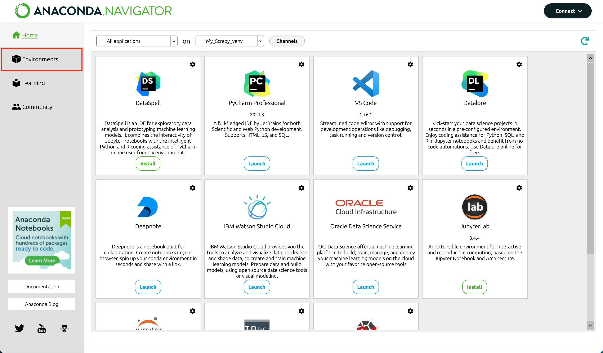
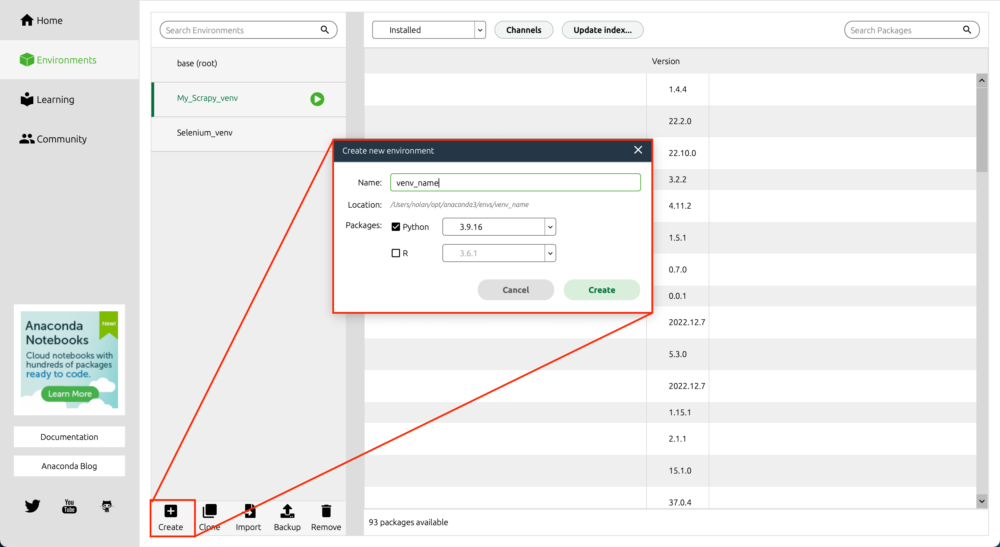
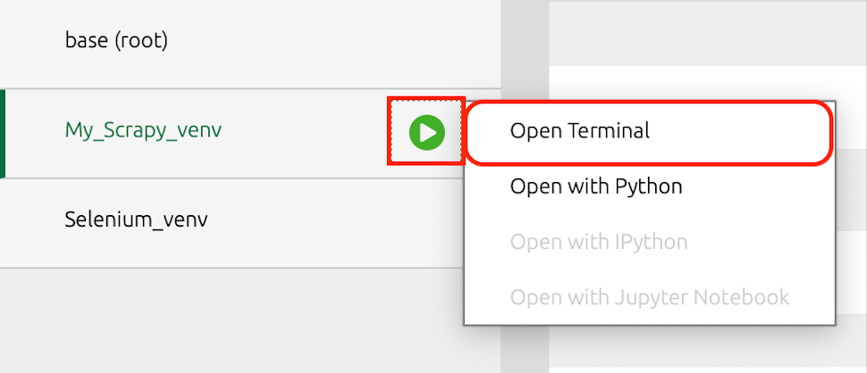
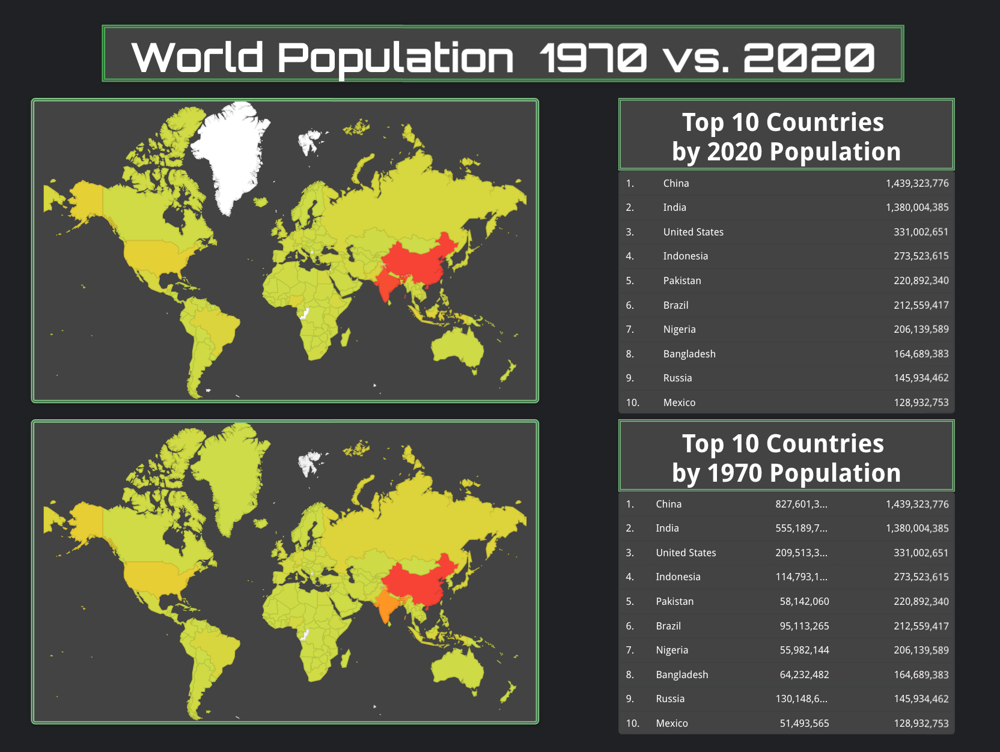
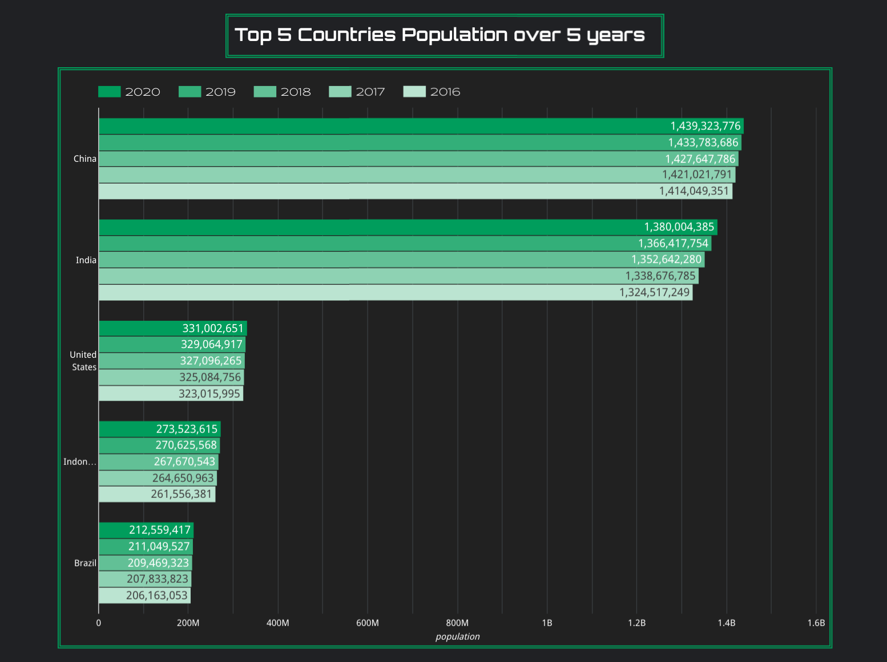
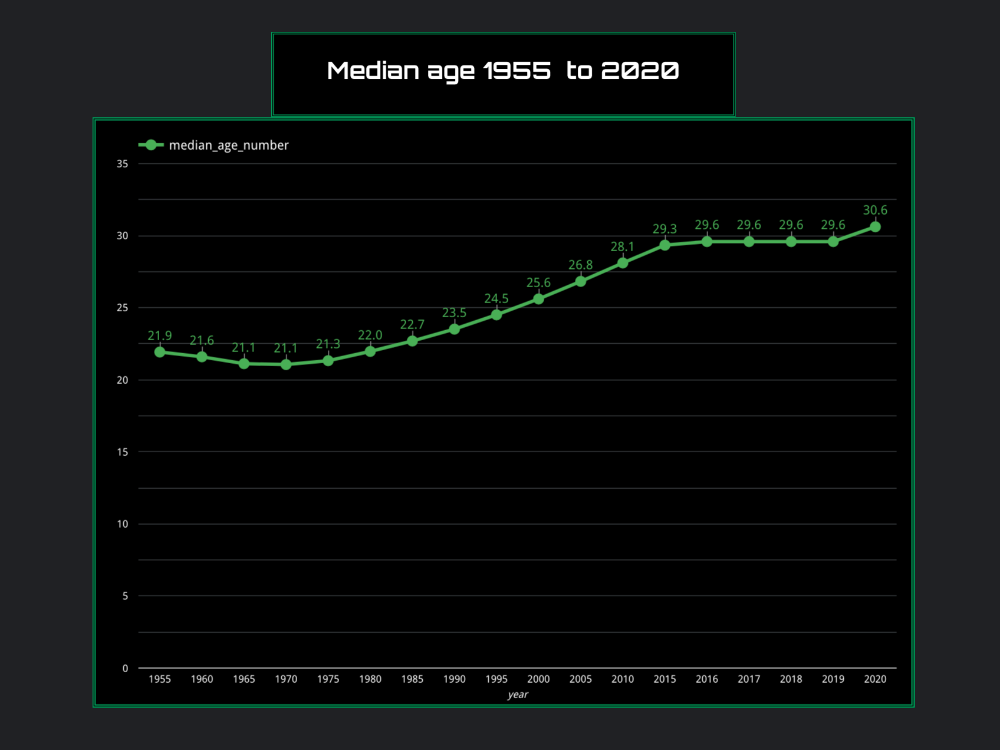
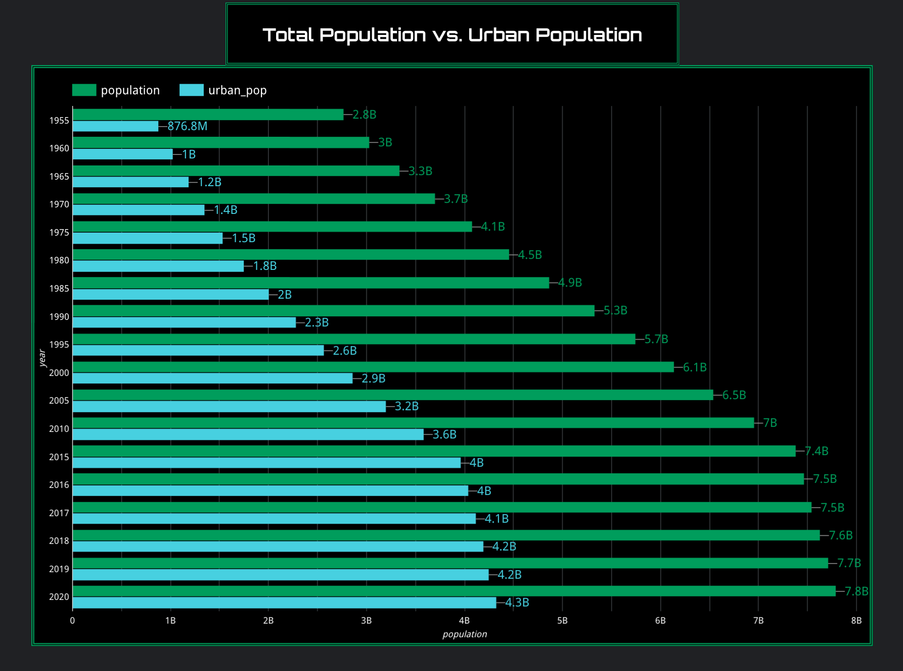

# World Data Scraper 
## Summary
I created a scraper to collect population and other related data from [Worldometer](https://www.worldometers.info/world-population/population-by-country/
). 
I wanted to work with and visualize a data set that I parsed myself. The simplest way to use my spider would be to put it in the spiders folder in a Scrapy project.
## Anaconda Navigator & Installing Scrapy
### Installation
To manage dependencies and easily access my different virtual environments I use Anaconda Navigator, I'll provide a link to the installer for [MacOS](https://www.anaconda.com/products/distribution)
### Setting up Environments
After opening Anaconda Navigator go to the Environments tab and create an Enviroment. After the environment is created open a terminal to start installing Scrapy.




### Scrapy
To install Scrapy go to the open terminal and use the command:
```
conda install -c conda-forge scrapy
```
When asked wheter to proceed answer 'y'. Then type 'which python', the path that this returns will be your interpreter path. After setting up the interpreter path use the command:
```
conda install -c conda-forge protego
```
Scrapy is set up. Next is to start a project to put the spider in. In the terminal navigate to the directory you want to start a project in and use:
```
scrapy startproject [project_name]
cd [project_name]
scrapy genspider [crawler_name] [domain]
```
Now in the project folder there will be a spiders folder. Move the Worldometer spider into that folder. To export the collected data in jsonlines format from the terminal use.
```
scrapy crawl [spider_name] -O [file_nane].jsonlines
```
## Big Query
Once the jsonlines file is saved. Upload the file to a Big Query database and export the data to Looker Studio.
## Visualizations
After parsing the data I created a few visual aids to bring life to all of it. 




